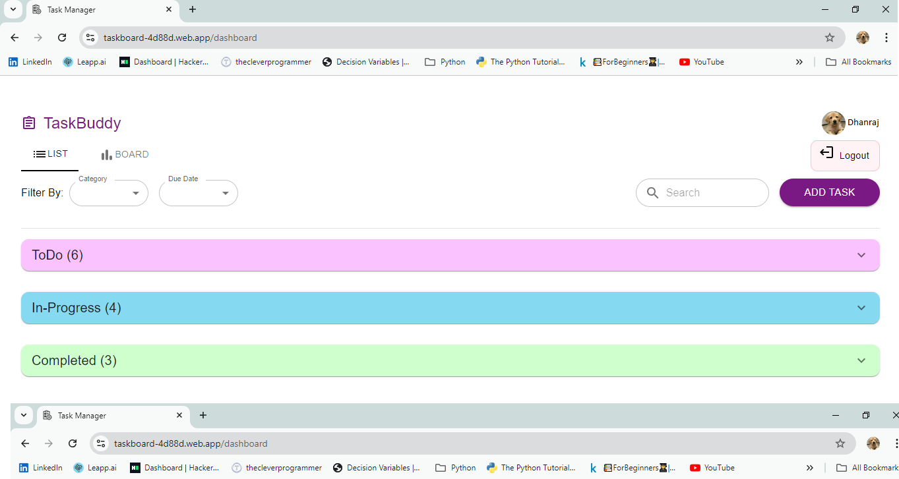
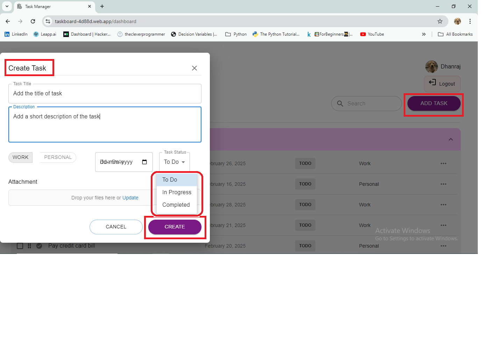
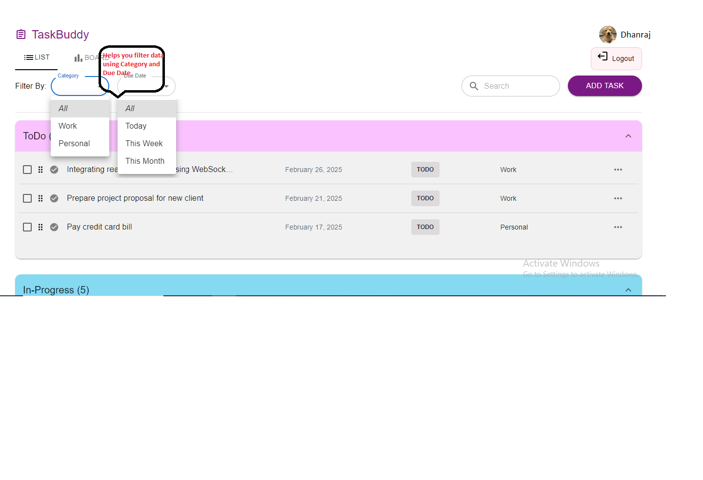

# Task Manager

Task Manager is a modern task management application designed to help you organize your tasks efficiently. It offers two views: **List View** and **Board View**, each divided into three sections: **To Do**, **In Progress**, and **Completed**. With features like adding, editing, and deleting tasks, drag-and-drop functionality, and advanced filtering, Task Manager  ensures a seamless task management experience.

  
*Task Manager in action.*

---

## Table of Contents
- [Features](#features)
- [Technologies Used](#technologies-used)
- [Installation](#installation)
- [Usage](#usage)
- [Acknowledgements](#acknowledgements)

---

## Features

- **Responsive Design**: Task Manager adapts seamlessly to different screen sizes, providing an optimized experience for both desktop and mobile devices.
  - **Desktop View**: Enjoy a spacious layout with two views: **List View** and **Board View**, each divided into three sections: **To Do**, **In Progress**, and **Completed**.
  - **Mobile View**: A streamlined, single-column layout for easy task management on smaller screens.
- **Task Management**:
  - Add, edit, and delete tasks.
  - Drag and drop tasks between sections (To Do, In Progress, Completed).
- **Advanced Filtering**:
  - Search tasks by name.
  - Filter tasks by Due Date (All, Today, This Week, This Month ) or Category (Personal or Work).
- **User Authentication**: Securely log in and manage your tasks.
- **Cross-Platform Compatibility**: Built with **Material UI** for a consistent and intuitive user interface across devices.
---

## Technologies Used

- **Frontend**:
  - TypeScript
  - React
  - React-DnD (for drag-and-drop functionality)
  - Material UI (for UI components)
  - Redux (for global state management)
- **Backend**:
  - Firebase (for user authentication and data storage)

---

## Installation

Follow these steps to set up Task Manager locally:

1. Clone the repository:
   ```bash
   git clone https://github.com/dhanraj12i/taskmanager.git
2. Navigate to the project directory:
    ```bash
    cd taskmanager
3. Install dependencies:
    ```bash
    npm install
4. Set up Firebase:
   - Create a Firebase project at Firebase Console.
   - Add your Firebase configuration in src/config/firebase-Config.ts.
     - Create a new file named firebase-Config.ts in the src directory.
     - Add the following code to the file and replace the placeholders with your Firebase project's configuration:
    
       ```typescript
       const firebaseConfig = {
       VITE_FIREBASE_API_KEY="Your_VITE_FIREBASE_API_KEY"
       VITE_FIREBASE_AUTH_DOMAIN="Your_VITE_FIREBASE_AUTH_DOMAIN"
       VITE_FIREBASE_PROJECT_ID="Your_FIREBASE_PROJECT_ID"
       VITE_FIREBASE_STORAGE_ID="Your_FIREBASE_STORAGE_ID"
       VITE_FIREBASE_MESSAGING_SENDER_ID="Your_FIREBASE_MESSAGING_SENDER_ID"
       VITE_FIREBASE_APP_ID="Your_FIREBASE_APP_ID"
       VITE_FIREBASE_M_ID="Your_FIREBASE_M_ID"
       };

       export default firebaseConfig;

    - Note: The original firebase-Config.ts file is not included in the repository due to sensitive information like API keys. You must create your own configuration file using your Firebase project details.
    - Create collection name tasks in firestore database.

5. Start the development server:
   ```bash
   npm run dev

6. Open your browser and visit http://localhost:5173.
 
7. Deployment_URL:- https://taskboard-4d88d.web.app/

## Usage

### Adding a Task
1. Click the **Add Task** button.
2. Enter the task details (title, description, category, and due date).
3. Click **Save**.

  

### Editing a Task
1. Click the **Edit** icon on the task card.
2. Update the task details.
3. Click **Save**.

### Deleting a Task
1. Click the **Delete** icon on the task card.
2. Confirm the deletion.

### Drag and Drop
- Drag tasks between **To Do**, **In Progress**, and **Completed** sections in the **Board View**.

### Searching and Filtering
- Use the **search bar** to find tasks by name.
- Filter tasks by **date** or **category** using the filter options.

  


## Acknowledgements
- **React-DnD**: For enabling drag-and-drop functionality.
- **Material UI**: For providing a sleek and responsive UI design.
- **Firebase**: For seamless user authentication and data storage.
- **Redux**: For efficient global state management.


